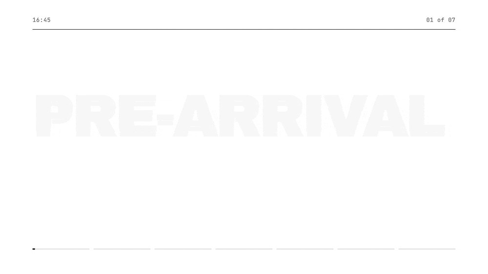
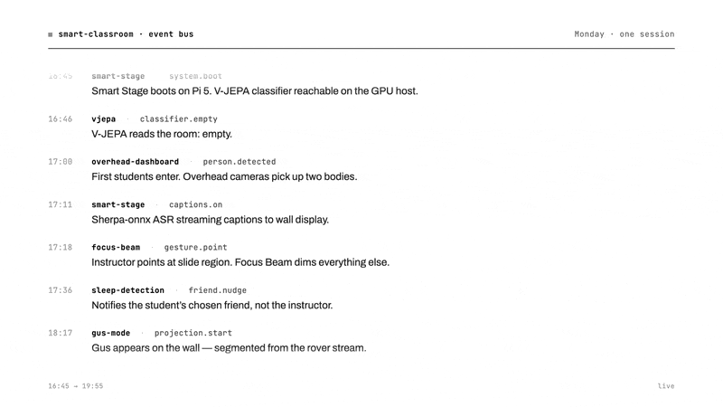

# Smart Classroom Story

**[Read the story →](https://kandizzy.github.io/smart-classroom-story)**

A scrollable storyboard companion to the [Smart Classroom whitepaper](https://github.com/kandizzy/smart-objects-cameras/blob/main/docs/whitepaper/multi-agent-classroom.md). One class session, traced phase by phase, told through the projects that activate the room.

## What this is

The whitepaper makes the architectural argument: this classroom is a multi-agent system where cameras, student code, and humans coordinate through a shared event bus. This site is the readable, magazine-style version of that same story — you scroll through one Monday session, 4:45 PM to 7:00 PM, and meet each project at the moment it enters the room.

It is **editorial, not aggregated**. Not a retro index, not a project gallery. Salient moments and quotes drawn from student retrospectives, vignettes, and interviews, woven into a single curated narrative.

## Structure

Seven phases of a class session:

1. **Pre-Arrival** — the room warms up
2. **Arrival** — bodies in the frame
3. **Lecture** — capture, attention, support (opt-in)
4. **Break** — Gus appears
5. **Group Work** — lab posture, surfaces, helpers
6. **Labs & Demos** — focused work, opt-in checks
7. **Wrap** — dismissal

Plus a closing thesis chapter and a credits page.

## Companion artifacts

- [Source repo](https://github.com/kandizzy/smart-objects-cameras) — class template, detectors, classroom API, all student work
- [Whitepaper](https://github.com/kandizzy/smart-objects-cameras/blob/main/docs/whitepaper/multi-agent-classroom.md) — the architectural argument
- [Network diagram](https://github.com/kandizzy/smart-objects-cameras/blob/main/docs/whitepaper/diagrams/network-diagram.html) — interactive topology of the classroom
- [References](https://github.com/kandizzy/smart-objects-cameras/blob/main/docs/whitepaper/references.md) — bibliography for the whitepaper

Smart Stage spans three repositories of its own:

- [so-smart-stage](https://github.com/ccheng2-commits/so-smart-stage) — Pi 5 orchestrator
- [so-vjepa-probe](https://github.com/ccheng2-commits/so-vjepa-probe) — V-JEPA classifier server
- [so-overhead-dashboard](https://github.com/ccheng2-commits/so-overhead-dashboard) — bird's-eye person tracking
- [NodCheck](https://github.com/katcheee/NodCheck) — Kathy's nod/head-shake comprehension check

## Contributors

**Students:** Darren Chia, Feifey Wang, Gordon Cheng, JuJu Kim, Kathy Choi, Phil Cote, Ramon Naula, Seren Kim, Shuyang Tian, Sophie Lee, Yuxuan Chen

Built spring 2026 at SVA MFA Interaction Design.

## License

Editorial copy and curation: © 2026 the contributors. The student work referenced (retros, diagrams, code) belongs to its respective authors and is reproduced here with attribution.
